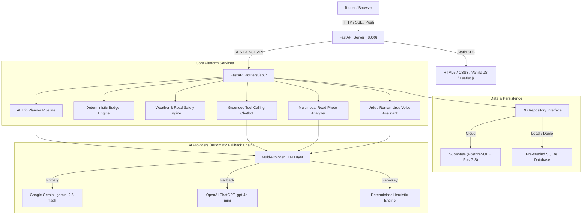

<div align="center">

# 🏔️ NaviGo

### AI-Powered Travel Companion for Northern Pakistan

*Plan smarter. Travel safer. Explore deeper.*

[](https://python.org)
[](https://fastapi.tiangolo.com)
[](tests/)
[](docs/)
[](LICENSE)

<br/>

> **NaviGo** is a production-grade, multimodal AI tourism platform built exclusively for Pakistan's northern travel corridors — Naran, Hunza, Skardu, Swat, Kashmir, Gilgit, and Fairy Meadows. It solves the problem of scattered, unreliable travel information by combining real-time AI, live weather, interactive maps, community road reporting, and a deterministic budget engine — all in one web app that runs entirely without any API keys in Demo Mode.

<br/>

[🚀 Quick Start](#-quickstart) · [✨ Features](#-features) · [🏛️ Architecture](#-architecture) · [🔑 Environment Variables](#-environment-variables) · [📡 API Reference](#-api-reference) · [🧪 Testing](#-testing) · [☁️ Deployment](#-deployment)

</div>

---

## ✨ Features

<table>
<tr>
<td width="50%">

### 🗺️ AI Trip Planner (SSE Streaming)
Multi-step itinerary generation with real-time progress stream. Accepts origin, destination, duration, traveler count, budget, and transport mode. Fetches live weather + active road alerts before generating day-by-day itineraries referencing real coordinates.

</td>
<td width="50%">

### 💰 Deterministic Budget Engine
LLMs can't do arithmetic — NaviGo doesn't let them. All costs (transport, hotels, food, jeep rentals) are calculated via a rule-based price catalog. Returns exact PKR breakdowns with **Within / Close / Over Budget** badges.

</td>
</tr>
<tr>
<td width="50%">

### 📸 Multimodal Road Photo Analyzer
Upload road photos from your phone or desktop. AI vision detects mud slides, standing water, snow, washouts, and landslides with confidence scores. Adds an instant map pin and opens community confirm / cleared voting.

</td>
<td width="50%">

### 🎙️ Voice Assistant (Urdu / Roman Urdu / English)
Speak naturally: *"Lahore se 3 din ke liye Naran jana hai, budget 40 hazar hai"* — NaviGo normalizes Urdu numerals, extracts intent, and fires the trip planner automatically.

</td>
</tr>
<tr>
<td width="50%">

### 🗣️ Grounded Tourism Chatbot
Function-calling chatbot with tools: `get_weather`, `get_road_status`, `search_places`, `estimate_budget`. Never invents non-existent places — returns verified data or says *"I don't have verified data for this location."*

</td>
<td width="50%">

### 🗾 Interactive Smart Map
Real Leaflet.js + OpenStreetMap tiles with category filtering (Attractions, Hotels, Restaurants, Fuel, Emergency). *"What's Around Me?"* geolocation with emergency hotlines (Rescue 1122, Police 15, KPK Tourism 1422).

</td>
</tr>
<tr>
<td width="50%">

### 🏪 Verified Marketplace + AI Review Summaries
Verified local hotels and certified mountain guides with AI-synthesized review summaries — pros and complaints extracted from real tourist feedback.

</td>
<td width="50%">

### ⚡ Zero-Key Demo Mode
Run the entire app with **no API keys at all**. Pre-seeded SQLite database, real Open-Meteo weather, and deterministic AI fallbacks mean the UI never crashes from a missing key.

</td>
</tr>
</table>

---

## 🏛️ Architecture



### How the Fallback Chain Works

| Priority | Provider | Triggered When |
|:---:|---|---|
| 1st | **Google Gemini** | `GEMINI_API_KEY` is set |
| 2nd | **OpenAI ChatGPT** | Gemini key missing or quota exceeded + `OPENAI_API_KEY` is set |
| 3rd | **Deterministic Engine** | No keys set — returns realistic rule-based outputs |

The app **always returns a useful response** regardless of which tier is active.

---

## 🛠️ Tech Stack

| Layer | Technology | Purpose |
|---|---|---|
| **Web Server** | FastAPI 0.111 + Uvicorn | Async HTTP, SSE streaming, static file serving |
| **Frontend** | Vanilla JS + HTML5 + CSS3 | Single-page app, zero build step |
| **Maps** | Leaflet.js + OpenStreetMap | Interactive markers, geolocation, category filter |
| **Weather** | Open-Meteo API | Free, no-key real-time weather for all destinations |
| **AI — Primary** | Google Gemini 2.5 Flash | Trip planning, vision analysis, chat, voice |
| **AI — Fallback** | OpenAI GPT-4o-mini | Automatic backup when Gemini quota is exceeded |
| **Routing** | OpenRouteService | Drive-time matrix between destinations |
| **Database** | SQLite (demo) / Supabase PostgreSQL (prod) | Trips, places, reviews, road reports |
| **Auth** | Supabase Auth (prod) / Demo user (local) | JWT-based sessions |
| **PDF Export** | ReportLab | Downloadable itinerary + budget voucher |
| **Push Alerts** | Web Push API + VAPID | Road condition notifications |
| **Testing** | pytest + httpx | 34 unit + integration tests |

---

## 🚀 Quickstart

### Prerequisites
- Python **3.10+**

### 1 — Clone & install

```powershell
# Windows PowerShell
git clone https://github.com/YOUR_USERNAME/navigo.git
cd navigo
python -m venv .venv
.venv\Scripts\activate
pip install -r requirements.txt
```

### 2 — Configure environment

```powershell
copy .env.example .env
```

> **You can skip this step entirely** — the app runs in Demo Mode with no keys needed.  
> Add keys only to unlock real AI responses (see [Environment Variables](#-environment-variables) below).

### 3 — Run

```powershell
python run.py
```

Open **[http://localhost:8000](http://localhost:8000)** in your browser. That's it. ✅

---

## 🔑 Environment Variables

Copy `.env.example` → `.env` and fill in the values you want. **Everything marked Optional works without a key.**

### Essential (Server)

| Variable | Required | Default | Description |
|---|:---:|---|---|
| `APP_ENV` | ✅ | `dev` | `dev` for local, `prod` for Replit/cloud |
| `PORT` | ✅ | `8000` | Server listen port |
| `HOST` | ✅ | `0.0.0.0` | Bind address (`0.0.0.0` for containers) |
| `PUBLIC_BASE_URL` | ✅ | `http://localhost:8000` | Canonical URL for share links |
| `ALLOWED_ORIGINS` | ✅ | `http://localhost:8000` | Comma-separated CORS origins |
| `CRON_SECRET` | Prod | `navigo_local_cron_secret` | Bearer token for internal cron routes |

### AI Providers

| Variable | Required | Default | Description |
|---|:---:|---|---|
| `GEMINI_API_KEY` | Optional | — | [Google AI Studio](https://aistudio.google.com/app/apikey) — primary AI provider |
| `GEMINI_MODEL` | Optional | `gemini-2.5-flash` | Gemini model ID |
| `OPENAI_API_KEY` | Optional | — | [OpenAI Platform](https://platform.openai.com/api-keys) — automatic fallback |
| `OPENAI_MODEL` | Optional | `gpt-4o-mini` | ChatGPT model ID |

### Database & Storage

| Variable | Required | Default | Description |
|---|:---:|---|---|
| `SUPABASE_URL` | Optional | — | Supabase project URL (cloud/prod) |
| `SUPABASE_ANON_KEY` | Optional | — | Safe-for-frontend public key |
| `SUPABASE_SERVICE_ROLE_KEY` | Optional | — | Backend admin key (never expose to client) |

### Optional Features

| Variable | Required | Default | Description |
|---|:---:|---|---|
| `ORS_API_KEY` | Optional | — | [OpenRouteService](https://openrouteservice.org) — drive-time matrix (falls back to haversine) |
| `VAPID_PUBLIC_KEY` | Optional | — | Web Push VAPID public key |
| `VAPID_PRIVATE_KEY` | Optional | — | Web Push VAPID private key |
| `VAPID_CLAIM_EMAIL` | Optional | `admin@navigo.app` | Web Push contact email |
| `ENABLE_INTERNAL_SCHEDULER` | Optional | `false` | Set `true` for persistent VM background cron |

> **Minimum for AI responses**: set `GEMINI_API_KEY` only. Everything else can stay blank.

---

## 📡 API Reference

Base URL: `http://localhost:8000/api`

### Trips

| Method | Endpoint | Description |
|---|---|---|
| `POST` | `/trips/plan` | Generate itinerary — **SSE stream** of progress events + final JSON |
| `GET` | `/trips` | List all saved trips |
| `GET` | `/trips/{trip_id}` | Get full trip with day plans |
| `POST` | `/trips/{trip_id}/replan` | Regenerate with updated constraints |
| `GET` | `/trips/{trip_id}/pdf` | Download PDF itinerary |
| `POST` | `/trips/budget/calculate` | Deterministic budget breakdown |

### Destinations & Places

| Method | Endpoint | Description |
|---|---|---|
| `GET` | `/destinations` | List all Northern Pakistan destinations |
| `GET` | `/destinations/{slug}` | Single destination with weather + places |
| `GET` | `/places` | Search / filter places by category & destination |

### AI Features

| Method | Endpoint | Description |
|---|---|---|
| `POST` | `/chat` | Single-turn grounded chatbot message |
| `POST` | `/chat/stream` | Streaming chat (SSE) |
| `POST` | `/voice/transcribe` | Audio → trip intent extraction |
| `POST` | `/vision/analyze` | Road photo → hazard classification + confidence |

### Community & Marketplace

| Method | Endpoint | Description |
|---|---|---|
| `GET` | `/reports` | Active road condition reports |
| `POST` | `/reports` | Submit new road report |
| `POST` | `/reports/{id}/vote` | Confirm or clear a report |
| `GET` | `/businesses` | Verified hotels & guides |
| `POST` | `/businesses/{id}/reviews` | Submit business review |
| `GET` | `/alerts` | Active weather & road alerts |
| `GET` | `/weather/{destination}` | Live Open-Meteo weather |

### User & System

| Method | Endpoint | Description |
|---|---|---|
| `GET` | `/me` | Current user profile |
| `GET` | `/health` | Server health check |
| `GET` | `/admin/stats` | Platform usage statistics |

---

## 📁 Project Structure

```
navigo/
│
├── run.py                      # ← Entry point: python run.py
├── requirements.txt
├── .env.example                # ← Copy to .env and configure
│
├── backend/
│   └── app/
│       ├── main.py             # FastAPI app, router mounts, middleware
│       ├── config.py           # All settings from environment variables
│       ├── deps.py             # Shared dependencies (auth, db session)
│       ├── errors.py           # Global exception handlers
│       │
│       ├── routers/            # One file per API resource
│       │   ├── trips.py        # Plan, list, PDF, replan
│       │   ├── chat.py         # Chatbot (single + stream)
│       │   ├── voice.py        # Audio transcription + intent
│       │   ├── vision.py       # Road photo analysis
│       │   ├── destinations.py # Destination data + weather
│       │   ├── places.py       # Place search + filter
│       │   ├── reports.py      # Community road reports
│       │   ├── businesses.py   # Verified marketplace
│       │   ├── alerts.py       # Weather & road alerts
│       │   ├── weather.py      # Live Open-Meteo proxy
│       │   ├── me.py           # User profile
│       │   └── internal_cron.py# Protected background jobs
│       │
│       ├── services/           # Business logic
│       │   ├── planner.py      # Trip generation pipeline
│       │   ├── budget.py       # Deterministic cost calculator
│       │   ├── chat_agent.py   # Grounded tool-calling chatbot
│       │   ├── vision.py       # Photo hazard classifier
│       │   ├── voice.py        # Urdu/Roman Urdu NLU
│       │   ├── pdf_export.py   # ReportLab PDF generator
│       │   ├── review_summary.py # AI review synthesizer
│       │   └── llm/
│       │       ├── gemini.py   # Google Gemini client
│       │       └── openai.py   # OpenAI ChatGPT client
│       │
│       └── db/
│           └── sqlite_demo.py  # SQLite adapter (local/demo)
│
├── frontend/
│   ├── index.html              # Single-page app (all pages in one file)
│   ├── css/style.css           # Complete stylesheet
│   ├── sw.js                   # Service Worker (offline + push)
│   └── js/
│       ├── app.js              # Page routing + init
│       ├── api.js              # Centralised fetch helpers
│       ├── plan.js             # Trip planner + history
│       ├── chat.js             # Chat UI + streaming
│       ├── map.js              # Leaflet map + markers
│       ├── analyzer.js         # Road photo upload + results
│       ├── voice.js            # Mic recording + voice flow
│       ├── destinations.js     # Explore page cards
│       └── state.js            # App-wide state (user, trips)
│
├── scripts/
│   ├── seed_demo_data.py       # Full DB seed (destinations, places, hotels)
│   ├── seed_showcase_trips.py  # Seed 6 canonical demo trips
│   ├── cron_weather_alerts.py  # Background weather alert job
│   └── smoke_test.py           # End-to-end HTTP smoke tests
│
├── tests/                      # pytest test suite (34 tests)
│   ├── test_trips.py
│   ├── test_chat_voice.py
│   ├── test_destinations.py
│   ├── test_places.py
│   ├── test_vision_reports.py
│   ├── test_marketplace.py
│   ├── test_me.py
│   ├── test_replanner.py
│   └── test_health.py
│
├── docs/
│   ├── DEPLOY_REPLIT.md        # Step-by-step Replit deployment guide
│   ├── API.md                  # Full API documentation
│   └── DEMO_SCRIPT.md          # Live demo walkthrough script
│
└── migrations/
    └── 001_initial_schema.sql  # PostgreSQL schema (Supabase prod)
```

---

## 🧪 Testing

Run the full automated test suite:

```powershell
# Activate virtual environment first
.venv\Scripts\activate

# Run all 34 tests
pytest

# Run with verbose output
pytest -v

# Run a specific test file
pytest tests/test_trips.py -v
```

Run end-to-end smoke tests against a live server:

```powershell
python scripts/smoke_test.py http://localhost:8000
```

After running `pytest`, re-seed the showcase trips to clean up test artifacts:

```powershell
python scripts/seed_showcase_trips.py
```

---

## ☁️ Deployment

### Replit (Recommended)

See the full click-by-click guide: **[docs/DEPLOY_REPLIT.md](docs/DEPLOY_REPLIT.md)**

**Quick summary:**
1. Upload the project to Replit
2. Set Secrets in the Replit dashboard (your `.env` keys)
3. The `.replit` file is pre-configured — just click **Run**

The server auto-detects `APP_ENV=prod` and binds to `0.0.0.0` with the correct port.

### Docker

```bash
docker build -t navigo .
docker run -p 8000:8000 --env-file .env navigo
```

### Any VPS / Cloud VM

```bash
pip install -r requirements.txt
APP_ENV=prod python run.py
```

Use Nginx as a reverse proxy and a process manager like `systemd` or `supervisor` for production.

---

## ⚡ Demo Mode vs. Full Mode

| Capability | Demo Mode (No Keys) | Full Mode (With Keys) |
|---|:---:|:---:|
| Trip planning (rule-based) | ✅ | ✅ |
| Real-time Open-Meteo weather | ✅ | ✅ |
| Interactive Leaflet map | ✅ | ✅ |
| Community road reports | ✅ | ✅ |
| Verified marketplace | ✅ | ✅ |
| PDF export | ✅ | ✅ |
| AI trip planning (LLM) | ⚡ Heuristic | ✅ Gemini / ChatGPT |
| Road photo AI analysis | ⚡ Heuristic | ✅ Gemini Vision |
| Voice NLU (Urdu) | ⚡ Keyword parser | ✅ Gemini / ChatGPT |
| Chatbot AI responses | ⚡ Grounded rules | ✅ LLM-enhanced |

---

## ⚠️ Advisory Notice

1. **No Official Road API**: Northern Pakistan mountain highways have no unified real-time telemetry API. Road conditions are community-reported and admin-verified.
2. **AI Outputs are Advisory**: Vision and place identification are supporting evidence only — not absolute safety guarantees.
3. **Booking Confirmation Required**: Hotel and guide availability shown in the marketplace must be confirmed directly with the business.

---

## 📄 License

© 2026 NaviGo. All rights reserved.

Built with ❤️ for travelers exploring the mountains of Pakistan.
