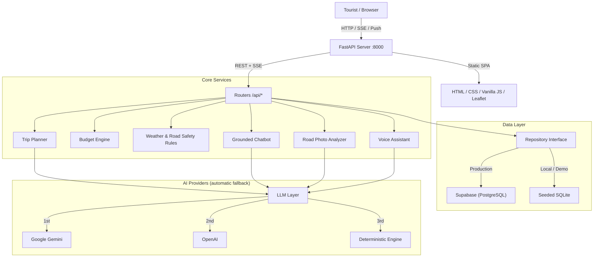

<div align="center">

# 🏔️ NaviGo

### AI-Powered Travel Companion for Northern Pakistan

*Plan smarter. Travel safer. Explore deeper.*

[](https://python.org)
[](https://fastapi.tiangolo.com)
[](tests/)
[](#-demo-mode-vs-full-mode)
[](LICENSE)

<br/>

**NaviGo** is a multimodal AI tourism platform for Pakistan's northern travel corridors: Naran, Hunza, Skardu, Swat, Kaghan, Gilgit and Fairy Meadows. It replaces scattered, unreliable travel information with AI trip planning, live weather, interactive maps, community road reporting and a deterministic budget engine, all in one web app that runs **without any API keys** in Demo Mode.

<br/>

[Quick Start](#-quick-start) · [Features](#-features) · [Architecture](#-architecture) · [Environment Variables](#-environment-variables) · [API](#-api-reference) · [Testing](#-testing) · [Deployment](#-deployment)

</div>

---

## ✨ Features

| | Feature | Description |
|---|---|---|
| 🗺️ | **AI Trip Planner (SSE streaming)** | Generates day-by-day itineraries with live progress updates. Takes origin, destination, duration, group size, budget and transport mode. Checks live weather and active road alerts before planning. |
| 💰 | **Deterministic Budget Engine** | Costs for transport, hotels, food and jeep rentals come from a rule-based price catalog, not from the LLM. Returns exact PKR breakdowns with *Within / Close / Over Budget* badges. |
| 📸 | **Road Photo Analyzer** | Upload a road photo and AI vision flags mud slides, standing water, snow, washouts and landslides with a confidence score, then drops a pin on the map and opens community confirm / cleared voting. |
| 🎙️ | **Voice Assistant (Urdu / Roman Urdu / English)** | Say *"Lahore se 3 din ke liye Naran jana hai, budget 40 hazar hai"* and NaviGo normalizes Urdu numerals, extracts the intent and starts the planner. |
| 🗣️ | **Grounded Tourism Chatbot** | Function-calling chatbot with `get_weather`, `get_road_status`, `search_places` and `estimate_budget` tools. It answers from verified data instead of inventing places. |
| 🗾 | **Interactive Smart Map** | Leaflet + OpenStreetMap with category filters (attractions, hotels, restaurants, fuel, emergency) and a "What's around me?" view with emergency hotlines. |
| 🏪 | **Verified Marketplace** | Local hotels and guides with AI-generated review summaries (pros and common complaints). |
| 📄 | **PDF Export** | Download an itinerary and budget summary as a PDF. |
| 🔔 | **Web Push Alerts** | Road and weather notifications through the Web Push API (VAPID). |
| ⚡ | **Zero-Key Demo Mode** | A pre-seeded SQLite database, real Open-Meteo weather and deterministic fallbacks keep the app fully usable with no keys. |

---

## 🏛️ Architecture



### AI fallback chain

| Priority | Provider | Used when |
|:---:|---|---|
| 1 | **Google Gemini** | `GEMINI_API_KEY` is set |
| 2 | **OpenAI** | Gemini is unavailable or out of quota and `OPENAI_API_KEY` is set |
| 3 | **Deterministic engine** | No AI keys are set, so the app returns rule-based results |

---

## 🛠️ Tech Stack

| Layer | Technology |
|---|---|
| Backend | FastAPI, Uvicorn, Pydantic v2 |
| Frontend | Vanilla JS, HTML5, CSS3 (no build step), Service Worker |
| Maps | Leaflet.js + OpenStreetMap |
| Weather | Open-Meteo (no key required) |
| AI | Google Gemini (primary), OpenAI (fallback) |
| Routing | OpenRouteService (falls back to haversine distance) |
| Database | SQLite (demo) / Supabase PostgreSQL (production) |
| PDF | ReportLab |
| Push | pywebpush (VAPID) |
| Testing | pytest + httpx |

---

## 🚀 Quick Start

**Prerequisite:** Python 3.10 or newer.

```bash
git clone https://github.com/musmancys/NaviGo.git
cd NaviGo

# create and activate a virtual environment
python -m venv .venv
source .venv/bin/activate        # Windows: .venv\Scripts\activate

pip install -r requirements.txt
cp .env.example .env             # Windows: copy .env.example .env
python run.py
```

Open **http://localhost:8000** (interactive API docs at `/docs`).

On the first run, `run.py` seeds the local demo database automatically. You can skip editing `.env` completely and the app will start in Demo Mode.

---

## 🔑 Environment Variables

Copy `.env.example` to `.env` and fill in only what you need. **Never commit `.env`.**

### Server

| Variable | Required | Default | Description |
|---|:---:|---|---|
| `APP_ENV` | ✅ | `dev` | `dev` locally, `prod` on cloud hosts |
| `PORT` | ✅ | `8000` | Server port |
| `HOST` | ✅ | `0.0.0.0` | Bind address |
| `PUBLIC_BASE_URL` | ✅ | `http://localhost:8000` | Public URL used for share links |
| `ALLOWED_ORIGINS` | ✅ | `http://localhost:8000,http://127.0.0.1:8000` | Comma-separated CORS origins |
| `CRON_SECRET` | Prod | `navigo_local_cron_secret` | Bearer token for `/api/internal/cron/*` (change it in production) |
| `ENABLE_INTERNAL_SCHEDULER` | Optional | `false` | `true` only on a persistent VM |

### AI providers

| Variable | Required | Description |
|---|:---:|---|
| `GEMINI_API_KEY` | Optional | Get one at [Google AI Studio](https://aistudio.google.com/app/apikey) |
| `GEMINI_MODEL` | Optional | Gemini model ID. Check AI Studio for a current model name |
| `OPENAI_API_KEY` | Optional | [OpenAI Platform](https://platform.openai.com/api-keys), used as the fallback |
| `OPENAI_MODEL` | Optional | Default `gpt-4o-mini` |

### Database and extras

| Variable | Required | Description |
|---|:---:|---|
| `SUPABASE_URL` | Optional | Supabase project URL |
| `SUPABASE_ANON_KEY` | Optional | Publishable / anon key (safe for the client) |
| `SUPABASE_SERVICE_ROLE_KEY` | Optional | Secret / service-role key. **Backend only** |
| `ORS_API_KEY` | Optional | [OpenRouteService](https://openrouteservice.org/dev/#/signup) drive-time matrix |
| `VAPID_PUBLIC_KEY` / `VAPID_PRIVATE_KEY` | Optional | Web Push keys |
| `VAPID_CLAIM_EMAIL` | Optional | Contact email for push notifications |

> **Minimum for real AI responses:** set `GEMINI_API_KEY` only.

---

## 📡 API Reference

Base URL: `http://localhost:8000/api` (full details in [docs/API.md](docs/API.md))

| Area | Method | Endpoint | Description |
|---|---|---|---|
| Trips | `POST` | `/trips/plan` | Generate an itinerary (SSE stream) |
| | `GET` | `/trips`, `/trips/{id}` | List trips / get a trip |
| | `POST` | `/trips/{id}/replan` | Regenerate with new constraints |
| | `GET` | `/trips/{id}/pdf` | Download the PDF itinerary |
| | `POST` | `/trips/budget/calculate` | Deterministic budget breakdown |
| Places | `GET` | `/destinations`, `/destinations/{slug}` | Destinations with weather and places |
| | `GET` | `/places` | Search places by category and destination |
| AI | `POST` | `/chat`, `/chat/stream` | Grounded chatbot |
| | `POST` | `/voice/transcribe` | Audio to trip intent |
| | `POST` | `/vision/analyze` | Road photo to hazard classification |
| Community | `GET` `POST` | `/reports` | Road condition reports |
| | `POST` | `/reports/{id}/vote` | Confirm or clear a report |
| | `GET` | `/businesses` | Verified hotels and guides |
| | `POST` | `/businesses/{id}/reviews` | Submit a review |
| | `GET` | `/alerts`, `/weather/{destination}` | Alerts and live weather |
| System | `GET` | `/me`, `/health`, `/admin/stats` | Profile, health check, stats |

---

## 📁 Project Structure

```
NaviGo/
├── run.py                  # Entry point (auto-seeds demo DB)
├── requirements.txt
├── .env.example
├── backend/app/
│   ├── main.py             # FastAPI app, middleware, router mounts
│   ├── config.py           # Settings from environment variables
│   ├── routers/            # trips, chat, voice, vision, destinations, places,
│   │                       # reports, businesses, reviews, alerts, weather, me, admin
│   ├── services/           # planner, replanner, budget, chat_agent, vision, voice,
│   │                       # weather, weather_rules, pdf_export, review_summary, llm/
│   ├── schemas/            # Pydantic models
│   └── db/                 # Repository layer, Supabase client, SQLite demo adapter
├── frontend/
│   ├── index.html          # Single-page app
│   ├── css/style.css
│   ├── sw.js               # Service worker (offline + push)
│   └── js/                 # app, api, plan, chat, map, analyzer, voice, destinations, state
├── migrations/             # PostgreSQL schema for Supabase
├── scripts/                # seed_demo_data, seed_showcase_trips, seed_places_overpass,
│                           # cron_weather_alerts, smoke_test
├── tests/                  # 34 pytest tests
├── docs/                   # API, Replit deployment, demo script, progress
└── reference/              # Original design reference and requirements
```

---

## 🧪 Testing

```bash
pytest                                   # run all 34 tests
pytest tests/test_trips.py -v            # one file, verbose
python scripts/smoke_test.py http://localhost:8000   # end-to-end check on a live server
```

Tests can create extra trips in the demo database. To restore the showcase data afterwards:

```bash
python scripts/seed_showcase_trips.py
```

---

## ☁️ Deployment

### Replit

1. Import the repo into Replit (**Create Repl → Import from GitHub**).
2. Add your variables in **Tools → Secrets** (set `APP_ENV=prod` and your public URL in `PUBLIC_BASE_URL` / `ALLOWED_ORIGINS`).
3. Press **Run**. The `.replit` file is already configured.

Step-by-step guide: [docs/DEPLOY_REPLIT.md](docs/DEPLOY_REPLIT.md), which also covers Render, Railway and Fly.io.

### Any VPS or VM

```bash
pip install -r requirements.txt
APP_ENV=prod python run.py
```

Put Nginx in front as a reverse proxy and run the app under `systemd` or `supervisor`.

---

## ⚡ Demo Mode vs Full Mode

| Capability | Demo (no keys) | Full (with keys) |
|---|:---:|:---:|
| Trip planning | ⚡ Rule-based | ✅ Gemini / OpenAI |
| Live Open-Meteo weather | ✅ | ✅ |
| Interactive map | ✅ | ✅ |
| Community road reports | ✅ | ✅ |
| Marketplace and PDF export | ✅ | ✅ |
| Road photo analysis | ⚡ Heuristic | ✅ Gemini Vision |
| Voice (Urdu) understanding | ⚡ Keyword parser | ✅ LLM-powered |
| Chatbot | ⚡ Grounded rules | ✅ LLM-enhanced |
| Persistent cloud database | SQLite | ✅ Supabase |

---

## ⚠️ Disclaimer

1. **No official road API:** Northern Pakistan's highways have no unified real-time data feed. Road conditions are community-reported and admin-verified.
2. **AI output is advisory:** Vision and place identification support decisions but are not safety guarantees.
3. **Confirm bookings:** Hotel and guide availability must be confirmed directly with the business.

---

## 🤝 Contributing

Issues and pull requests are welcome. Please run `pytest` before submitting changes.

## 📄 License

Released under the [MIT License](LICENSE). © 2026 Muhammad Usman.

<div align="center">Built for travelers exploring the mountains of Pakistan. 🏔️</div>
